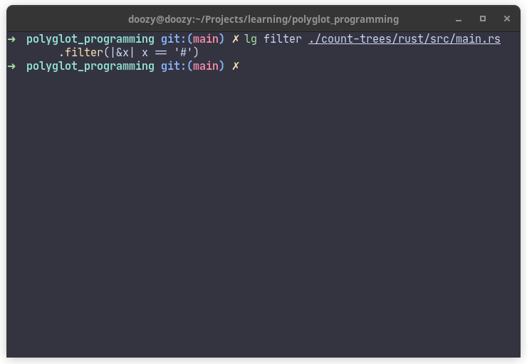

## Lil Grep
Simple and minimal grep alternative written in rust.

## Installation
After cloning the repo run `cargo build --release` and copy the release binary file (`./target/release/lilgrep`) over to `~/.local/share/bin/lg`.

TL;DR - run the following commands

```bash
cargo run build --release
cp ./target/release/lilgrep ~/.local/share/bin/lg
```
